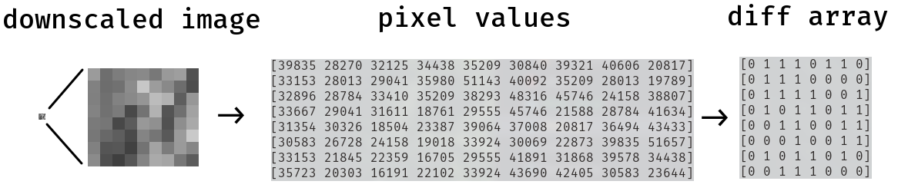

# imagehash
[](https://travis-ci.org/devedge/imagehash)
[](https://godoc.org/github.com/devedge/imagehash)
[](https://gocover.io/github.com/devedge/imagehash)

Golang implementation of image hashing algorithms


## dhash
This is an implementation of the `dhash` algorithm [found here](http://archive.is/NFLVW) (archived link), and also [implemented in Python  here](https://github.com/JohannesBuchner/imagehash).
It depends on the `imaging` Go package [found here](https://github.com/disintegration/imaging) for basic image transformation operations.


The `dhash` algorithm generates a nearly unique signature for an image, based on the gradient difference between pixels.
It is used to determine the similarity between two images. Similar images will have a nearly identical hash result, while different images will not.

#### Install:

`go get -u github.com/devedge/imagehash`

#### Usage:

```go
package main

import (
  "fmt"
  "encoding/hex"  // To transform the byte array to hex
  "github.com/devedge/imagehash"
)

func main() {
  // OpenImg() uses the image opening function found in 'imaging'
  src,_ := imagehash.OpenImg("./testdata/lena_512.png")

  // The length of a downscaled side. It must be > 8, and
  // (hashLen * hashLen) must be a multiple of 8
  //
  // A value of 8 will return 64 bits, or 8 bytes / 16 hex characters
  // (64 bits = 8 bits length * 8 bits width)
  hashLen := 8

  // Calculate both horizontal and vertical diffs, then concatenate
  // and return them as: <horizontal diff><vertical diff>
  hash,err := imagehash.Dhash(src, hashLen)
  if err != nil {
    // Catch an error that may be thrown
  }
  fmt.Println("dhash:           ", hex.EncodeToString(hash))

  // Calculate a horizontal gradient diff. 'src' is an 'image.Image'
  // The returned value is of type []byte
  hashH,_ := imagehash.DhashHorizontal(src, hashLen)
  fmt.Println("Horizontal dhash:", hex.EncodeToString(hashH))

  // Calculate a vertical gradient diff
  hashV,_ := imagehash.DhashVertical(src, hashLen)
  fmt.Println("Vertical dhash:  ", hex.EncodeToString(hashV))
}
```
<br>

The Hamming distance between two byte arrays can be determined using a package like [hamming](https://github.com/steakknife/hamming):

```go
package main

import (
  "fmt"
  "encoding/hex"
  "github.com/devedge/imagehash"
  "github.com/steakknife/hamming"
)

func main() {
  src512,_ := imagehash.OpenImg("./testdata/lena_512.png")
  src256,_ := imagehash.OpenImg("./testdata/lena_256.png")
  srcInv,_ := imagehash.OpenImg("./testdata/lena_inverted_512.png")

  hash512,_ := imagehash.Dhash(src512, 8)
  hash256,_ := imagehash.Dhash(src256, 8)
  hashInv,_ := imagehash.Dhash(srcInv, 8)

  // Hamming distance of 0, since the images are simply different sizes
  fmt.Println("'lena_512.png' dhash:", hex.EncodeToString(hash512))
  fmt.Println("'lena_256.png' dhash:", hex.EncodeToString(hash256))
  fmt.Println("The Hamming distance between these:", hamming.Bytes(hash512, hash256))

  fmt.Println()

  // Completely different dhash, since an inverted image has a completely
  // different gradient colorscheme
  fmt.Println("'lena_512.png' dhash:         ", hex.EncodeToString(hash512))
  fmt.Println("'lena_inverted_512.png' dhash:", hex.EncodeToString(hashInv))
  fmt.Println("The Hamming distance between these:", hamming.Bytes(hash512, hashInv))
}
```

#### Implementation:

First, the image is grayscaled:
<br>


To calculate the horizontal gradient difference, the image is resized down, using the `hashLen` variable.

In this example, `hashLen = 8`, so the image is scaled down to `9x8px`. Then, if `pixel[x] < pixel[x+1]`, a `1` is appended to a byte array; otherwise, a `0`. This results in 8 bits of data per row, for 8 columns, or 64 bits total:
<br>



This array of 1s and 0s is then flattened, and returned as a byte array: <br>
`0111011001110000011110010101101100110011000100110101101000111000`

Which can also be represented in hex as `7670795b33135a38` using `hex.EncodeToString(result)`
<br>

Conversely, to obtain a vertical diff, the image would be scaled down to `8x9px`, and the diff matrix would be the result of `pixel[y] < pixel[y+1]`.

#### Dependencies:
* [imaging](https://github.com/disintegration/imaging) - Simple Go image processing package
